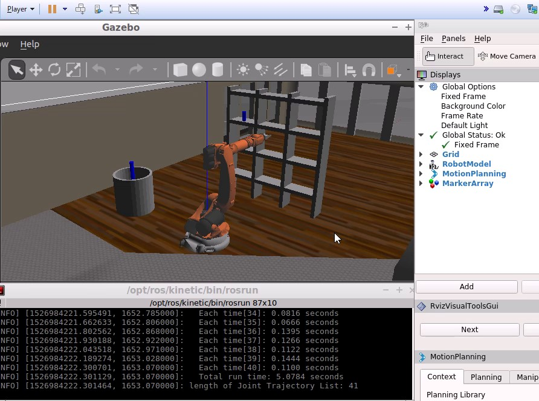
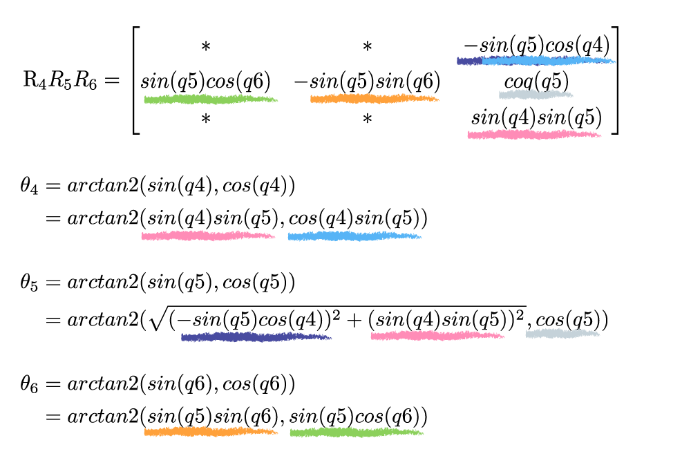

## Project: Kinematics Pick & Place

[](https://youtu.be/J0nR4XqxEBI)

[📄 Click on image to see the simulator video.](https://youtu.be/J0nR4XqxEBI)

---


**Steps to complete the project:**

1. ✅ Set up your ROS Workspace.
  → **OK.**
2. ✅ Download or clone the [project repository](https://github.com/udacity/RoboND-Kinematics-Project) into the ***src*** directory of your ROS Workspace.
  → **Ok, this repository.**
3. ✅ Experiment with the forward_kinematics environment and get familiar with the robot.
  → **I learned it in the course and tried demo**.
4. ✅ Launch in [demo mode](https://classroom.udacity.com/nanodegrees/nd209/parts/7b2fd2d7-e181-401e-977a-6158c77bf816/modules/8855de3f-2897-46c3-a805-628b5ecf045b/lessons/91d017b1-4493-4522-ad52-04a74a01094c/concepts/ae64bb91-e8c4-44c9-adbe-798e8f688193).
  → **I tried it.**
5. ✅ Perform Kinematic Analysis for the robot following the [project rubric](https://review.udacity.com/#!/rubrics/972/view).
  → **I read it.**
6. ✅ Fill in the `IK_server.py` with your Inverse Kinematics code. 
  → **OK. But too slow...🤔**

[//]: # (Image References)

[image1]: ./misc_images/demo01.jpg
[image2]: ./misc_images/misc3.png
[image3]: ./misc_images/misc2.png
[Rx]: ./misc_images/R_x(alpha_{i-1}).png
[Dx]: ./misc_images/D_x(a_{i-1}).png
[Rz]: ./misc_images/R_z(theta_i).png
[Dz]: ./misc_images/D_z(d_i).png
[Ti-eq00]: ./misc_images/Ti-eq00.png "T^{i-1}_{i}=R_x(\alpha_{i-1}) D_x(a_{i-1}) R_z(\theta_i) D_z(d_i)"
[logger]: ./misc_images/logger.gif
[fig1]: ./misc_images/fig1.png
[fig1_angles]: ./misc_images/fig1_angles.png
[fig2]: ./misc_images/fig2.png
[fig3]: ./misc_images/fig3.png

## [Rubric](https://review.udacity.com/#!/rubrics/972/view) Points
### Here I will consider the rubric points individually and describe how I addressed each point in my implementation.  

---
### Writeup / README

#### 1. Provide a Writeup / README that includes all the rubric points and how you addressed each one.  You can submit your writeup as markdown or pdf.  

You're reading it! → **OK.**

### Kinematic Analysis
#### 1. Run the forward_kinematics demo and evaluate the kr210.urdf.xacro file to perform kinematic analysis of Kuka KR210 robot and derive its DH parameters.

Here is an example of how to include an image in your writeup.

* ✅ I tried demo.

* ✅ Uploaded own image.

![alt text][image1]

#### 2. Using the DH parameter table you derived earlier, create individual transformation matrices about each joint. In addition, also generate a generalized homogeneous transform between base_link and gripper_link using only end-effector(gripper) pose.

![Ti-eq00]

|     | ![Rx]      | ![Dx]  | ![Rz]    | ![Dz]
---   | ---        | ---    | ---      | ---
Links | alpha(i-1) | a(i-1) | theta(i) | d(i)
0->1  | 0          | 0      | θ₁       | 0.75 (=0.33+0.42)
1->2  | -π/2       | 0.35   | θ₂-π/2   | 0
2->3  | 0          | 1.25   | θ₃       | 0
3->4  | -π/2       | -0.054 | θ₄       | 1.5 (=0.96+0.54)
4->5  | π/2        | 0      | θ₅       | 0
5->6  | -π/2       | 0      | θ₆       | 0
6->EE | 0          | 0      | 0        | 0.303 (=0.193+0.11)

> ⚠ **Swapped columns between `theta(i)` and `d_i`** to coincident with the `Ti` expression.

#### 3. Decouple Inverse Kinematics problem into Inverse Position Kinematics and inverse Orientation Kinematics; doing so derive the equations to calculate all individual joint angles.

And here's where you can draw out and show your math for the derivation of your theta angles.

**theta1, theta2, theta3** :

1. Obtain `fig3_side`s(a,b,c)

    fig3:

    ![fig3][fig3]

    📝 fig2_b == fig3_c

1. Obtain `fig2 side`s(a,b,c)

    fig2:

    ![fig2][fig2]

    📝 fig1_b == fig2_c


1. Obtain `fig1 side`s(a,b,c)

    fig1:

    ![fig1][fig1]

1. Obtain angles(`theta1`, `theta2`, `theta3`).

    fig1 angles:

    ![fig1_angles][fig1_angles]

1. (The rest of the code is `IK_server.py` or `IK_debug.py`)

**theta4, theta5, theta6** :



### Project Implementation

#### 1. Fill in the `IK_server.py` file with properly commented python code for calculating Inverse Kinematics based on previously performed Kinematic Analysis. Your code must guide the robot to successfully complete 8/10 pick and place cycles. Briefly discuss the code you implemented and your results. 

**Result: 10/10**

* Environments:

  ```text
  * Host OS: Windows 10 (build 16299)
    * Memory: 16GB
    * CPU: Intel Core i7-6700
    * GPU: GeForce GTX 970

  * Guest OS: Ubuntu 64-bit Robo V2.1.0 (lubuntu base)
  * VM: VMware Workstation 14 Player
  * VM Settings:
    * Memory: 4GB
    * Processors: 2
    * VRAM: 768MB
  ```

* **Appealing points**:
  * **Move common codes to out of loop**.

    Ex. Rolling, Rotation Matrix operations.

  * Do the test enough in the `IK_debug.py`.

  * Minimum code:

    → Avoid excessive optimizations due to readable.

  * Add the logging code for the performance tuning.

    ![logger]

* **Improvement ideas**:
  * **More efficient algorithms for angles**.

    Ex. Reduce unnecessary motion of rotation.

    But, is updateable areas by us? 🤔

  * **Too slow?** 🤔
    * Turn at using sympy.

      Ex. use `lambdify()` or `lambdify-numpy()` instead of `evalf()` or `subs()`

      ref. [Numeric Computation — SymPy 1.1.1 documentation](http://docs.sympy.org/latest/modules/numeric-computation.html)

    * Environtments:

      → enough.

    * Motion, Motion Planning:

      → Is updateable areas too  by us? 🤔 
